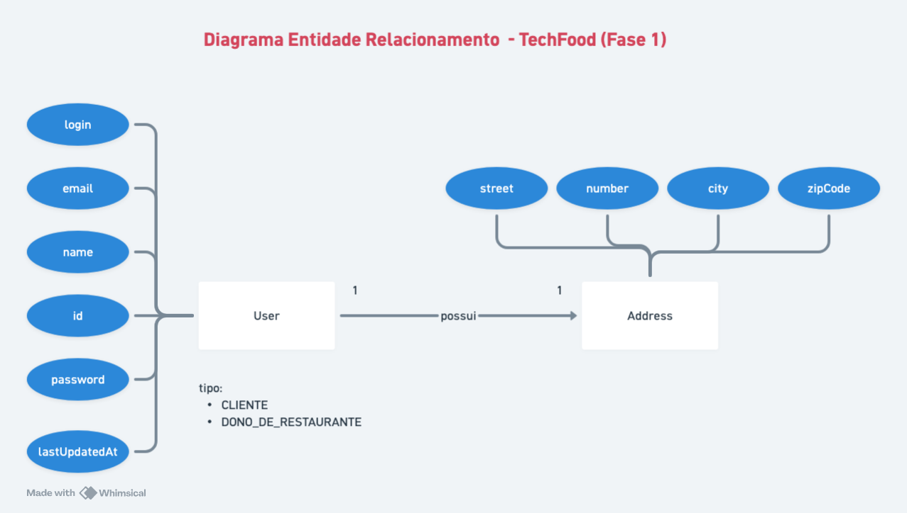
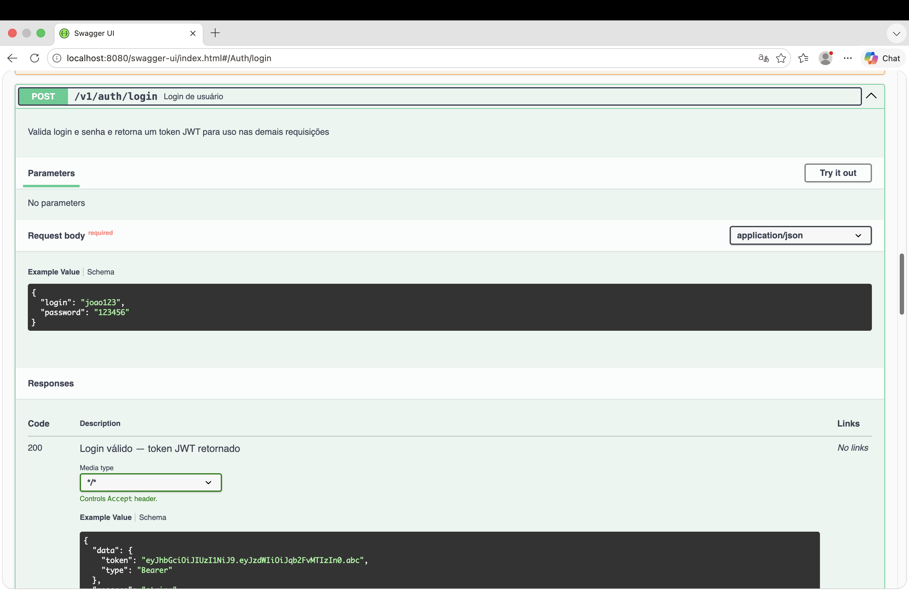
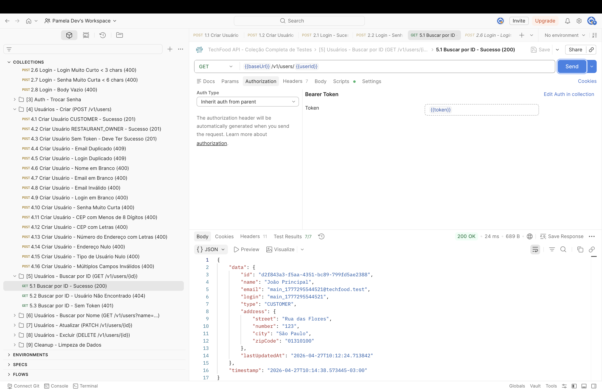

# Tech Challenge - Fase 02

API REST desenvolvida com Java e Spring Boot para gerenciamento de usuários em um sistema de delivery compartilhado entre restaurantes.

---

## Contexto do Projeto

Um grupo de restaurantes decidiu contratar estudantes para construir um sistema de gestão para seus estabelecimentos. Essa decisão
foi motivada pelo alto custo de sistemas individuais, o que levou os
restaurantes a se unirem para desenvolver um sistema único e compartilhado.

Esse sistema permitirá que os clientes escolham restaurantes com base na comida oferecida, em vez de se basearem na qualidade do sistema de gestão.

---

## Tecnologias

- Java 21
- Spring Boot 3.4.2
- Spring Web
- Spring Data JPA
- Spring Security + JWT
- PostgreSQL
- Flyway (versionamento de schema)
- Docker & Docker Compose
- MapStruct
- Lombok
- SpringDoc OpenAPI
- Maven

---

## Arquitetura

A partir da Fase 2, a aplicação segue Clean Architecture, com dependências sempre apontando para dentro (infraestrutura → aplicação → domínio):

- **domain** → entidades de negócio puras (`Usuario`, `TipoUsuario`, `Endereco`), interfaces de repositório e exceções de domínio. Sem nenhuma dependência de framework.
- **application** → casos de uso (um por operação de negócio, ex: `CriarUsuarioUseCase`), DTOs de entrada/saída e portas (`CodificadorDeSenha`, `GeradorDeToken`) que a infraestrutura implementa.
- **infrastructure** → detalhes técnicos: entidades JPA + mappers (MapStruct) + implementações de repositório (`persistence`), controllers REST (`controller`), segurança/JWT (`security`) e configuração (`config`).

Princípios aplicados:
- SOLID
- Clean Code
- Separação de responsabilidades por camada (Domain / Application / Infrastructure)

### Diagrama de Arquitetura (Fase 1):


---

## Tipos de Usuário

- Dono de restaurante
- Cliente

---

## Funcionalidades

- Cadastro de usuários
- Atualização de dados
- Endpoint exclusivo para troca de senha
- Exclusão de usuários
- Busca de usuários por nome (paginada)
- Validação de login (login + senha)
- Garantia de e-mail único
- Registro da data da última alteração

---

## Banco de Dados

### PostgreSQL

Configuração padrão:
- Host: localhost
- Porta: 5432
- Database: tech_challenge_fase02
- Usuário: postgres
- Senha: admin

### Diagrama de Classes (Fase 1)


### Modelo Entidade-Relacionamento (Fase 1)


### Versionamento com Flyway

Migrations SQL em `src/main/resources/db/migration/`:
- `V1__create_table_user.sql` - Criação da tabela de usuários
- `V2__alter_users_add_unique_index.sql` - Adição de índices únicos
- `V3__insert_users.sql` - Inserção de dados iniciais
- `V4__create_table_tipos_usuario.sql` - Criação da tabela de tipos de usuário
- `V5__insert_tipos_usuario.sql` - Seed dos tipos "Cliente" e "Dono de Restaurante"
- `V6__alter_users_add_tipo_usuario_id.sql` - Adição da coluna `tipo_usuario_id` (FK) em `users`
- `V7__backfill_users_tipo_usuario_id.sql` - Backfill de `tipo_usuario_id` a partir da antiga coluna `type`
- `V8__finalize_users_tipo_usuario_id.sql` - Torna `tipo_usuario_id` obrigatória e remove a coluna `type`

> A tabela `users` mantém o nome herdado da Fase 1 — apenas os identificadores Java (classes/pacotes/endpoints) foram traduzidos para PT-BR, conforme convenção do grupo.

### H2 Database (Testes)

Durante execução de testes, a aplicação utiliza H2 Database em memória.

---

## Segurança

A aplicação utiliza Spring Security com autenticação baseada em JWT, garantindo:

- Proteção de endpoints
- Autenticação stateless
- Controle de acesso

---

## Endpoints

### Autenticação

| Método | Endpoint | Descrição |
|--------|----------|-----------|
| POST | `/v1/autenticacao/login` | Autentica usuário e retorna JWT |

### Usuários

| Método | Endpoint | Descrição |
|--------|----------|-----------|
| GET | `/v1/usuarios/{id}` | Busca usuário por ID |
| GET | `/v1/usuarios?nome={nome}&page={page}&size={size}` | Busca usuários por nome (paginado) |
| POST | `/v1/usuarios` | Cria novo usuário (recebe `tipoUsuarioId`) |
| PATCH | `/v1/usuarios/{id}` | Atualiza dados do usuário |
| PUT | `/v1/usuarios/{id}/senha` | Altera a senha do usuário |
| DELETE | `/v1/usuarios/{id}` | Remove usuário |

> Tipo de Usuário (CRUD completo de `/v1/tipos-usuario`), Restaurante e Item de Cardápio são adicionados pelos próximos membros do grupo (ver `docs/planejamento-fase2.md`).

---

## Tratamento de Erros

A API segue o padrão RFC 7807 (Problem Details) para padronização das respostas de erro.

---

## Como executar o projeto

### Pré-requisitos

- Java 21 (JDK Temurin ou OpenJDK)
- Maven 3.8+
- PostgreSQL 15+ (para execução sem Docker) OU Docker

### Opção 1: Com Docker

#### Subir ambiente completo (aplicação + PostgreSQL):

```bash
cd docker
docker-compose up --build
```

A aplicação estará disponível em: http://localhost:8080

#### Subir apenas o PostgreSQL:

```bash
cd docker
docker-compose -f docker-compose-postgres.yaml up -d
```

Depois execute (na raiz do projeto):
```bash
mvn clean install
mvn spring-boot:run
```

### Opção 2: Execução local

#### 1. Clonar repositório

```bash
git clone <url-do-repositorio>
cd tech-challenge-fase02
```

#### 2. Configurar PostgreSQL local

Certifique-se de que PostgreSQL está rodando em `localhost:5432` com:
- Database: tech_challenge_fase02
- Usuário: postgres
- Senha: admin

#### 3. Compilar e rodar

```bash
# Compilar e instalar dependências
mvn clean install

# Executar aplicação
mvn spring-boot:run
```

A aplicação estará disponível em: http://localhost:8080

---

## Documentação Swagger

Documentação interativa disponível em:

```
http://localhost:8080/swagger-ui/index.html
```

Especificação OpenAPI (JSON):

```
http://localhost:8080/v3/api-docs
```



---

## Testes com Postman

Collection disponível em: `postman/TechChallengeFase02-postman_collection.json`

Importar no Postman:
1. Abrir Postman
2. File → Import
3. Selecionar arquivo `postman/TechChallengeFase02-postman_collection.json`




---

## Testes Unitários

### Executar todos os testes

```bash
mvn test
```

### Executar testes de uma classe específica

```bash
mvn test -Dtest=UsuarioControllerTest
```

### Executar testes com cobertura e aplicar o gate mínimo (80%)

```bash
mvn clean verify
```

O relatório HTML fica disponível em `target/site/jacoco/index.html`. O build falha (`jacoco:check`) se a cobertura de linhas cair abaixo de 80%.

Testes inclusos:
- Testes unitários dos casos de uso de usuário e autenticação (mock dos repositórios/portas)
- Testes de segurança (JWT, `UsuarioDetailsServiceImpl`)
- Testes unitários dos controllers (`UsuarioController`, `AutenticacaoController`)
- Testes de integração (MockMvc + H2 + Flyway) cobrindo os fluxos principais e erros da API

---

## Build

Compilar e gerar artefato JAR executável:

```bash
mvn clean install
```


---

## Grupo

- Lucas Walim da Silva
- Pamela Mendes Ribeiro
- Rafael Oliveira Rodrigues Valle
- Rodrigo Eufrásio Daniel
- Rodrigo Cavalcante de Barros


**Projeto desenvolvido na pós-tech em Arquitetura e Desenvolvimento Java pela FIAP.**